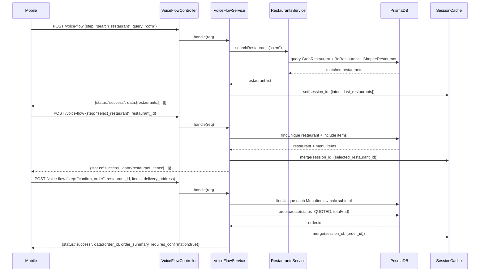
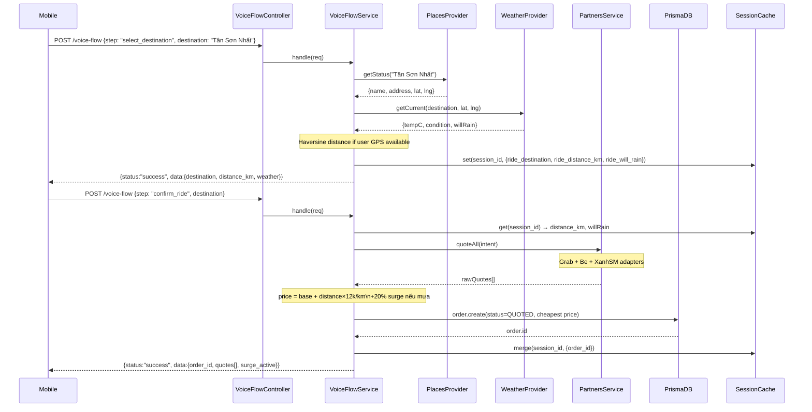
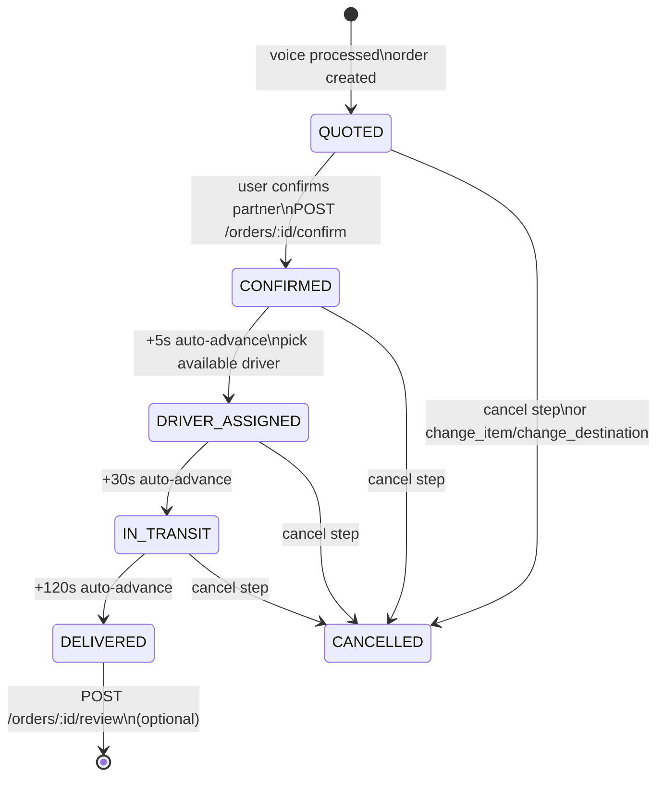
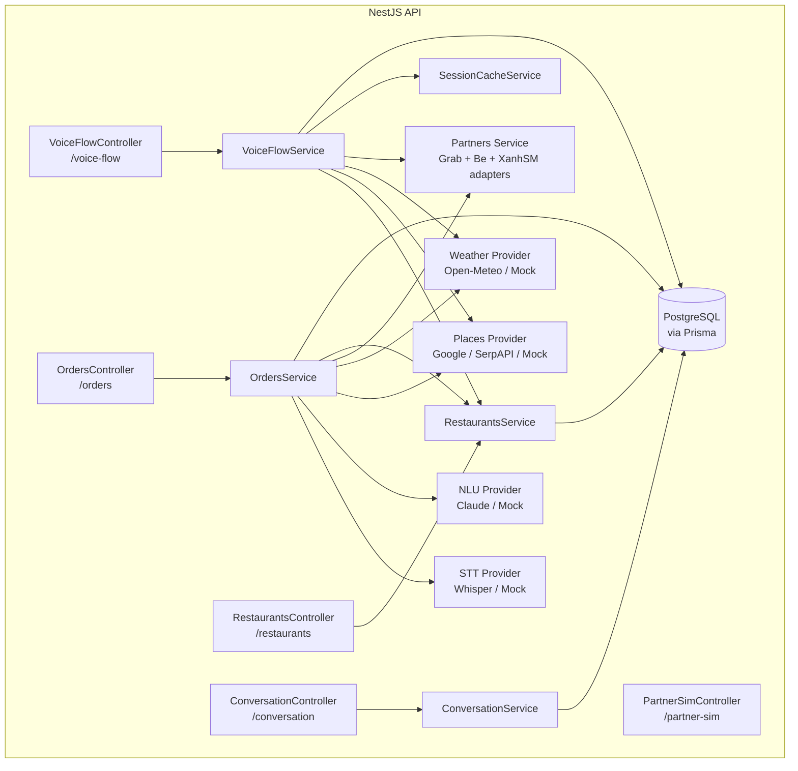
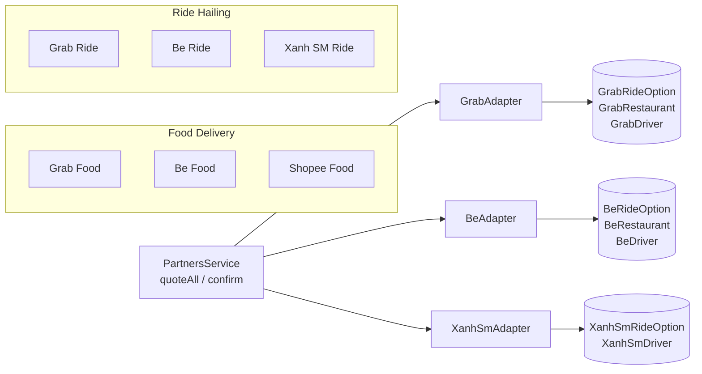

# Backend Architecture Diagrams

> **⚠️ Lưu ý về dữ liệu đối tác**
>
> Tất cả bảng mang tên đối tác (`GrabRestaurant`, `BeRestaurant`, `ShopeeRestaurant`, `XanhSmRideOption`, v.v.) **đều là dữ liệu giả lập (mock/fixture) do team tự tạo**, không phải dữ liệu thật từ hệ thống của Grab / Be / Shopee / Xanh SM.
>
> Project **không tích hợp API thật** của bất kỳ đối tác nào. Các adapter (`grab.adapter.ts`, `be.adapter.ts`, `xanh-sm.adapter.ts`) chỉ đọc từ PostgreSQL nội bộ — dùng để mô phỏng luồng so sánh giá đa nền tảng cho mục đích hackathon demo.

## 1. Database Schema (ERD)

```mermaid
erDiagram
    User {
        String id PK
        String name
        String phone
        String savedAddress
        DateTime createdAt
    }
    Order {
        String id PK
        String userId FK
        String type "RIDE|FOOD"
        String origin
        String destination
        String deliveryAddress
        String partnerRestaurantId
        String restaurant
        Json items
        String status "QUOTED|CONFIRMED|DRIVER_ASSIGNED|IN_TRANSIT|DELIVERED|CANCELLED"
        String partner "GRAB|BE|XANH_SM|SHOPEE"
        String partnerDriverId
        String driverName
        Int subtotalVnd
        Int deliveryFeeVnd
        Int discountVnd
        Int totalVnd
        Int etaMinutes
        Boolean accessibilityFlag
        DateTime createdAt
    }
    OrderEvent {
        String id PK
        String orderId FK
        String step "STT|NLU|ENRICHMENT|PARTNER_QUOTE|CONFIRM|..."
        Json payload
        DateTime createdAt
    }
    OrderReview {
        String id PK
        String orderId FK
        Int restaurantRating
        Int driverRating
        String voiceText
        DateTime createdAt
    }
    ConversationSession {
        String id PK
        String userId FK
        String state "COLLECTING|CONFIRMING|ORDERING|TRACKING|DONE"
        Json intent
        String[] missingFields
        String orderId
        DateTime updatedAt
    }
    Place {
        String id PK
        String name
        String address
        Int openHour
        Int closeHour
        String[] keywords
        Boolean rainOverride
    }

    %% GRAB
    GrabRestaurant {
        String id PK
        String name
        String address
        Float lat
        Float lng
        Int openHour
        Int closeHour
        String cuisineType
        Float rating
        String[] keywords
        Int deliveryFeeVnd
        Boolean available
    }
    GrabMenuItem {
        String id PK
        String grabRestaurantId FK
        String categoryName
        String name
        Int priceVnd
        Boolean available
    }
    GrabRideOption {
        String id PK
        String serviceType "GrabCar|GrabBike"
        Int basePriceVnd
        Int etaMinutes
        Boolean available
    }
    GrabDriver {
        String id PK
        String name
        String vehicleType
        String vehiclePlate
        Float rating
        Boolean available
        Float currentLat
        Float currentLng
    }
    GrabPromotion {
        String id PK
        String grabRestaurantId FK
        String discountType "PERCENT|FIXED|FREE_DELIVERY"
        Int discountValue
        Boolean active
    }

    %% BE
    BeRestaurant {
        String id PK
        String name
        String address
        Float lat
        Float lng
        Int openHour
        Int closeHour
        String[] keywords
        Int deliveryFeeVnd
        Boolean available
    }
    BeMenuItem {
        String id PK
        String beRestaurantId FK
        String name
        Int priceVnd
        Boolean available
    }
    BeRideOption {
        String id PK
        String serviceType "beCar|beBike"
        Int basePriceVnd
        Int etaMinutes
        Boolean available
    }
    BeDriver {
        String id PK
        String name
        String vehicleType
        Boolean available
        Float currentLat
        Float currentLng
    }
    BePromotion {
        String id PK
        String beRestaurantId FK
        String discountType
        Int discountValue
        Boolean active
    }

    %% XANH SM (ride only)
    XanhSmRideOption {
        String id PK
        String serviceType "XanhSM Car"
        Int basePriceVnd
        Int etaMinutes
        Boolean available
    }
    XanhSmDriver {
        String id PK
        String name
        String vehicleType "XanhSM Car (VinFast)"
        Boolean available
        Float currentLat
        Float currentLng
    }

    %% SHOPEE (food only)
    ShopeeRestaurant {
        String id PK
        String name
        String address
        Int openHour
        Int closeHour
        String[] keywords
        Int deliveryFeeVnd
        Boolean available
    }
    ShopeeMenuItem {
        String id PK
        String shopeeRestaurantId FK
        String name
        Int priceVnd
        Boolean available
    }
    ShopeeDriver {
        String id PK
        String name
        String vehicleType "Shopee Bike"
        Boolean available
        Float currentLat
        Float currentLng
    }
    ShopeePromotion {
        String id PK
        String shopeeRestaurantId FK
        String discountType
        Int discountValue
        Boolean active
    }

    User ||--o{ Order : "places"
    User ||--o{ ConversationSession : "has"
    Order ||--o{ OrderEvent : "logs"
    Order ||--o| OrderReview : "reviewed_by"
    GrabRestaurant ||--o{ GrabMenuItem : "has"
    GrabRestaurant ||--o{ GrabPromotion : "has"
    BeRestaurant ||--o{ BeMenuItem : "has"
    BeRestaurant ||--o{ BePromotion : "has"
    ShopeeRestaurant ||--o{ ShopeeMenuItem : "has"
    ShopeeRestaurant ||--o{ ShopeePromotion : "has"
```

---

## 2. Voice Flow — FOOD Order Pipeline

---

## 3. Voice Flow — RIDE Order Pipeline

---

## 4. Order State Machine (Orders Legacy API)

---

## 5. Backend Module Architecture

---

## 6. Partner Adapters

